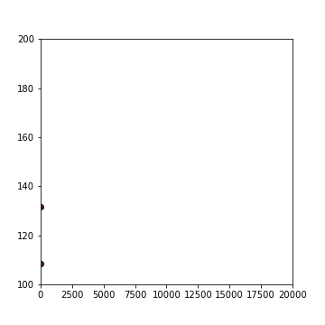

# Hello World
Pythonでよく使うものをオブジェクト化してまとめたものです。
imagesは無視してください。基本的にファイル単位でのダウンロードがおすすめです

## 中身
* AnimePlot.py

tiffのスタック画像としてグラフを保存します。保存結果はフォルダで出力されます。
プロットにアニメーションをつけたい場合に利用してください。
最後にImageJなどでgifに変換してください
<br>
使用例
```python
import AnimePlot as AP
ap = AP.AnimePlot(パス("a/folda"),横比, 縦比, (0,100)などの形でxlim, ylim)
ap.set_color(["blue", "green"]) # 色のリスト(トラックしたいデータの数だけ色を追加してください)
ap.set_data(x_data, [data1, data2]) # yのデータをリストで渡してください(※色リストとサイズを合わせてください)
ap.set_marker() # マーカーを追加してください
ap.plot_timelapse(10) # インターバルを設定して実際にプロットを保存します
```
実行結果例


